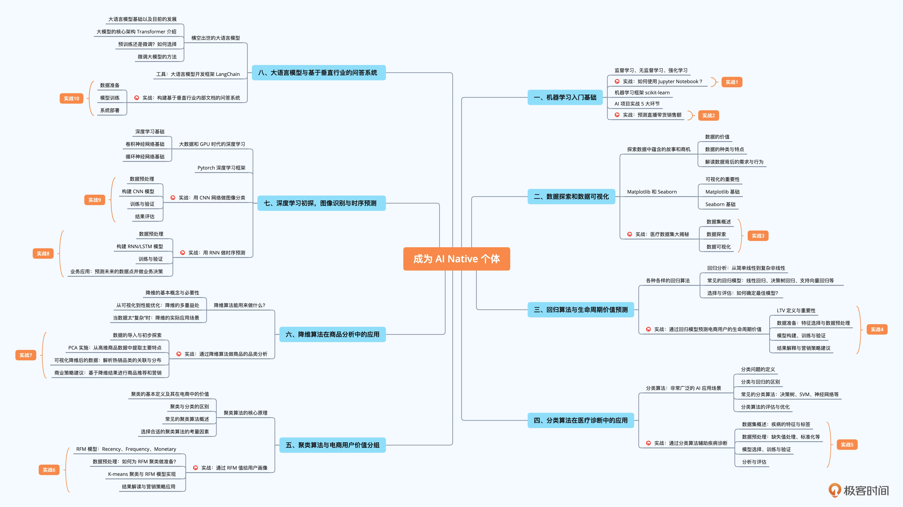
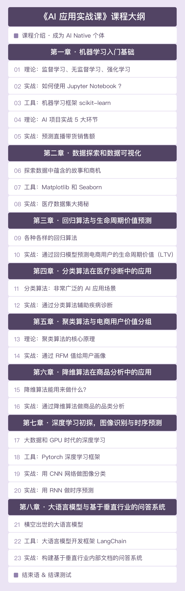

## AI 应用实战课

欢迎来到 AI 应用实战课项目！这是一个基于开源代码的学习教程，旨在帮助您学习和实践各种人工智能应用。

喜欢这个Repo，就要[到这里](http://gk.link/a/12oxx)购买此课，支持佳哥

### 项目简介

AI 应用实战课是一个包含实用示例和项目的学习教程，涵盖了多个领域的人工智能应用。通过参与本项目，使成为一个 AI Native，一个真正理解并能运用 AI 技术的个体。通过深入浅出的教学方式，逐步引导你从 AI 的基本概念开始，到最终能够熟练应用各种 AI 工具和算法解决实际问题。


### 课程目录


### 内容共8课，包括：
 - AI 的定义、历史、影响力，机器学习的基础，包括监督学习、无监督学习和强化学习，以及如何使用 Jupyter Notebook 和 scikit-learn。
 - 数据探索和数据可视化，包括如何使用 Matplotlib 和 Seaborn。
 - 回归算法与生命周期价值预测，包括各种回归算法的介绍和实战。
 - 分类算法在医疗诊断中的应用，包括常见分类算法的介绍和实战。
 - 聚类算法与电商用户价值分组，包括聚类算法的核心原理和实战。
 - 降维算法在商品分析中的应用，包括降维的基本概念和实战。
 - 深度学习初探，图像识别与时序预测，包括深度学习的基础知识、Pytorch 深度学习框架、图像识别与 CNN、时序预测与 RNN。
 - 大语言模型与基于垂直行业的问答系统，包括大语言模型的基础知识、开发框架 LangChain、垂直行业的问答系统实战。


### 项目结构 
```
ai-in-practice/
├── docs/ 其他文档
├── 第1课_机器学习入门基础/
│   ├── FirstPgm.ipynb
│   ├── Scikit-Learn降维算法示例.ipynb
│   ├── 漏斗分析.ipynb
│   ├── 直播带货.csv
│   ├── 直播带货.py
│   └── 直播带货AI实战5部曲.ipynb
├── 第2课_数据探索和数据可视化/
│   ├── 医疗数据可视化.ipynb
│   └── 某地乳腺检查数据.csv
├── 第3课_回归算法与生命周期价值预测/
│   ├── 回归算法预测LTV.ipynb
│   └── 电商历史订单.csv
├── 第4课_分类算法在医疗诊断中的应用/
│   ├── 医疗数据分类.ipynb
│   └── 某地乳腺检查数据.csv
├── 第5课_聚类算法与电商用户价值分组/
│   ├── 电商历史订单.csv
│   └── 电商用户RFM聚类分析.ipynb
├── 第6课_降维算法在商品分析中的应用/
│   ├── .ipynb_checkpoints/
│   │   └── PCA-checkpoint.ipynb
│   ├── PCA.ipynb
│   └── 品类降维.csv
├── 第7课_深度学习初探图像识别与时序预测/
│   ├── AppRNN.csv
│   ├── CNN_OwnNet_CIFAR10.py
│   ├── CNN_ResNet_CIFAR10.py
│   ├── PyTorch_目标检测_Inference.ipynb
│   ├── RNN_TimeSeries.ipynb
│   ├── RNN_TimeSeries.py
│   ├── Read_Local_Image.py
│   └── dog_bike_car.jpg
├── 第8课_大语言模型与基于垂直行业的问答系统/
│   ├── OneFlower/
│   │   ├── .ipynb_checkpoints/
│   │   │   ├── 易速鲜花员工手册-checkpoint.pdf
│   │   │   └── 花语大全-checkpoint.txt
│   │   ├── 易速鲜花员工手册.pdf
│   │   ├── 易速鲜花运营指南.docx
│   │   └── 花语大全.txt
│   └── LangChain_DocQA.ipynb
├── README.md 项目说明
```


